# 《数据库概论》实验二 高级SQL 实验报告

**姓名：** 李云浩	**学号：** 241880324   **联系方式：** 241880324@qq.com

---

## 实验环境

操作系统为 windows，采用VS code ide 以及其中的 SQL Tools 插件进行代码编写和运行。MySQL 版本是 8.0.46-winx64，高级程序语言代码部分则采用 C 语言。

## 实验过程

### T1.1

**代码部分：**

```sql
CREATE PROCEDURE info_product (IN product_name VARCHAR(40))
    SELECT Customer.customerNo, Customer.customerName, OrderDetail.orderNo, OrderDetail.quantity, (OrderDetail.price * OrderDetail.quantity)
    FROM OrderDetail
    JOIN Product ON OrderDetail.productNo = Product.productNo
    JOIN OrderMaster ON OrderMaster.orderNo = OrderDetail.orderNo
    JOIN Customer ON Customer.customerNo = OrderMaster.customerNo
    WHERE Product.productName = product_name
    ORDER BY (OrderDetail.price * OrderDetail.quantity) DESC;

CALL info_product ('32M DRAM');
```

**实验截图：**

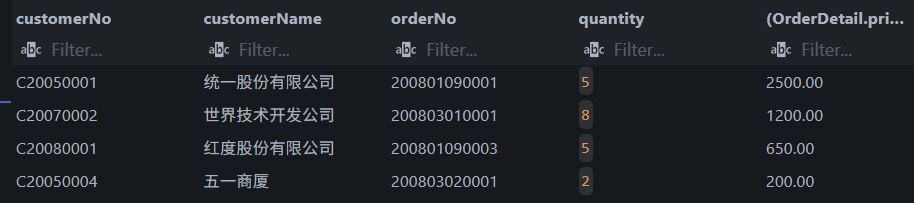

---

### T1.2

**代码部分：**

```sql
CREATE PROCEDURE info_employee (IN employee_No CHAR(8))
    SELECT E2.employeeNo, E2.employeeName, E2.gender, E2.hireDate, E2.department
    FROM Employee AS E1
    JOIN Employee AS E2 ON E1.department = E2.department
    WHERE E1.employeeNo = employee_No AND E1.hireDate > E2.hireDate;

CALL info_employee ('E2008005');
```

**实验截图：**

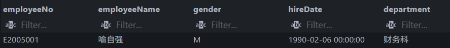

---

### T2.1

**代码部分：**

```sql
CREATE FUNCTION average_price(product_name VARCHAR(40))
RETURNS FLOAT
READS SQL DATA
RETURN (
    SELECT SUM(quantity * price) / SUM(quantity)
    FROM OrderDetail
    JOIN Product ON Product.productNo = OrderDetail.productNo
    WHERE Product.productName = product_name
);

SELECT productName, average_price(productName)
FROM Product;
```

**实验截图：**

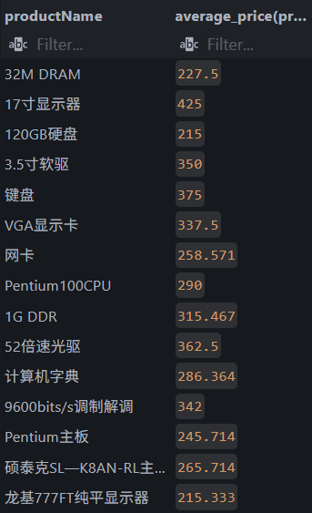

---

### T2.2

**代码部分：**

```sql
CREATE FUNCTION count_sum (product_no CHAR(9))
RETURNS INTEGER
READS SQL DATA
RETURN (
    SELECT SUM(quantity)
    FROM OrderDetail
    WHERE productNO = product_no
);

SELECT productNo, productName, count_sum(productNo)
FROM Product
WHERE count_sum(productNo) > 4;
```

**实验结果：**

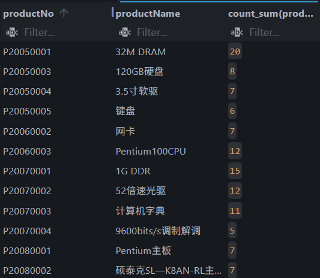

---

### T3.1

**代码部分：**

```sql
CREATE TRIGGER set_product_price
BEFORE INSERT ON Product
FOR EACH ROW
BEGIN
    IF NEW.productPrice > 1000
        THEN SET NEW.productPrice = 1000;
    END IF;
END;

INSERT INTO Product 
VALUES ('114514', 'tempProduct', 'tempClass', 1919.81);

SELECT *
FROM Product
WHERE productName = 'tempProduct';
```

**实验结果：**


---

### T3.2

**代码部分：**

```sql
DROP TRIGGER IF EXISTS add_salary;

CREATE TRIGGER add_salary
AFTER INSERT ON OrderMaster
FOR EACH ROW
BEGIN
    UPDATE Employee
    SET salary = salary *
        CASE
            WHEN hireDate < '1992-01-01' THEN 1.08
            ELSE 1.05
        END
    WHERE employeeNo = NEW.employeeNo;
END;

SELECT employeeName, salary
FROM employee
WHERE employeeNo = 'E2005001' OR employeeNo = 'E2005005';

INSERT INTO OrderMaster
VALUES ('123', 'C20050001', 'E2005001', '20260521', 0.00, '1');
INSERT INTO OrderMaster
VALUES ('456', 'C20050002', 'E2005005', '20060520', 0.00, '2');

SELECT employeeName, salary
FROM employee
WHERE employeeNo = 'E2005001' OR employeeNo = 'E2005005';

DROP TRIGGER IF EXISTS add_salary;
```

**实验结果：**

加订单前：

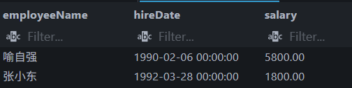

加订单后：

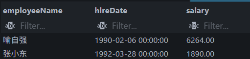

---

### T4

**实验代码：**

```sql
#include <stdio.h>
#include <stdlib.h>
#include <mysql.h>

int main(void){
    MYSQL *conn;
    MYSQL_RES *result;
    MYSQL_ROW row;

    // MySQL 连接参数，对应本机上的 OrderDB 数据库。
    const char *host = "127.0.0.1";
    const char *user = "lyh";
    const char *password = "123456";
    const char *database = "OrderDB";
    const unsigned int port = 3306;

    conn = mysql_init(NULL);
    mysql_real_connect(conn, host, user, password, database, port, NULL, 0);

    // 查询工资最高的 20 名员工。
    const char* sql1 = 
            "SELECT employeeNo, employeeName, salary "
            "FROM Employee "
            "ORDER BY salary DESC "
            "LIMIT 20";
        
    mysql_query(conn, sql1);
    result = mysql_store_result(conn);

    printf("%-10s %-10s %-10s\n", "employeeNo", "employeeName", "salary");
    printf("--------------------------------------------------------------\n");
    while ((row = mysql_fetch_row(result)) != NULL) {
        printf(
            "%-10s %-10s %-10s\n",
            row[0] ? row[0] : "NULL",
            row[1] ? row[1] : "NULL",
            row[2] ? row[2] : "NULL"
        );
    }

    // 插入一条客户记录，并再次查询该客户检查插入结果。
    const char* sql2 = 
            "INSERT INTO Customer "
            "VALUES ('C20080002', '泰康股份有限公司', '010-5422685', '天津市', '220501')";
    
    const char* sql2_test = 
            "SELECT * "
            "FROM Customer "
            "WHERE customerNo = 'C20080002'";

    mysql_query(conn, sql2);
    mysql_query(conn, sql2_test);
    result = mysql_store_result(conn);

    printf("%-10s %-10s %-10s %-10s %-10s\n", "customerNo", "customerName", "telephone", "address", "zip");
    printf("--------------------------------------------------------------\n");
    while ((row = mysql_fetch_row(result)) != NULL) {
        printf(
            "%-10s %-10s %-10s %-10s %-10s\n",
            row[0] ? row[0] : "NULL",
            row[1] ? row[1] : "NULL",
            row[2] ? row[2] : "NULL",
            row[3] ? row[3] : "NULL",
            row[4] ? row[4] : "NULL"
        );
    }

    // 删除工资大于 5000 的员工，删除前后各打印一次便于对比。
    const char* sql3 =
            "DELETE FROM Employee "
            "WHERE salary > 5000";

    const char* sql3_test = 
            "SELECT employeeName, salary "
            "FROM Employee";

    mysql_query(conn, sql3_test);
    result = mysql_store_result(conn);

    printf("%-10s %-10s\n", "employeeName", "salary");
    printf("--------------------------------------------------------------\n");
    while ((row = mysql_fetch_row(result)) != NULL) {
        printf(
            "%-10s %-10s\n",
            row[0] ? row[0] : "NULL",
            row[1] ? row[1] : "NULL"
        );
    }

    mysql_query(conn, sql3);
    
    mysql_query(conn, sql3_test);
    result = mysql_store_result(conn);

    printf("%-10s %-10s\n", "employeeName", "salary");
    printf("--------------------------------------------------------------\n");
    while ((row = mysql_fetch_row(result)) != NULL) {
        printf(
            "%-10s %-10s\n",
            row[0] ? row[0] : "NULL",
            row[1] ? row[1] : "NULL"
        );
    }
    

    // 将价格大于 1000 的产品打五折，更新前后各打印一次便于对比。
    const char* sql4 =
            "UPDATE Product "
            "SET productPrice = productPrice * 0.5 "
            "WHERE productPrice > 1000";
    
    const char* sql4_test = 
            "SELECT productName, productPrice "
            "FROM Product";

    mysql_query(conn, sql4_test);
    result = mysql_store_result(conn);

    printf("%-10s %-10s\n", "productName", "productPrice");
    printf("--------------------------------------------------------------\n");
    while ((row = mysql_fetch_row(result)) != NULL) {
        printf(
            "%-10s %-10s\n",
            row[0] ? row[0] : "NULL",
            row[1] ? row[1] : "NULL"
        );
    }
    mysql_query(conn, sql4);
    mysql_query(conn, sql4_test);
    result = mysql_store_result(conn);

    printf("%-10s %-10s\n", "productName", "productPrice");
    printf("--------------------------------------------------------------\n");
    while ((row = mysql_fetch_row(result)) != NULL) {
        printf(
            "%-10s %-10s\n",
            row[0] ? row[0] : "NULL",
            row[1] ? row[1] : "NULL"
        );
    }
}
```

**实验结果：**

其中部分图像中左侧为操作前，右侧为操作后

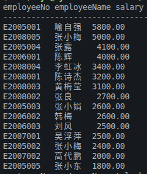

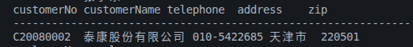

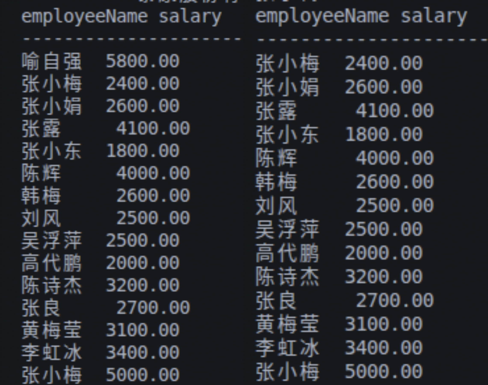

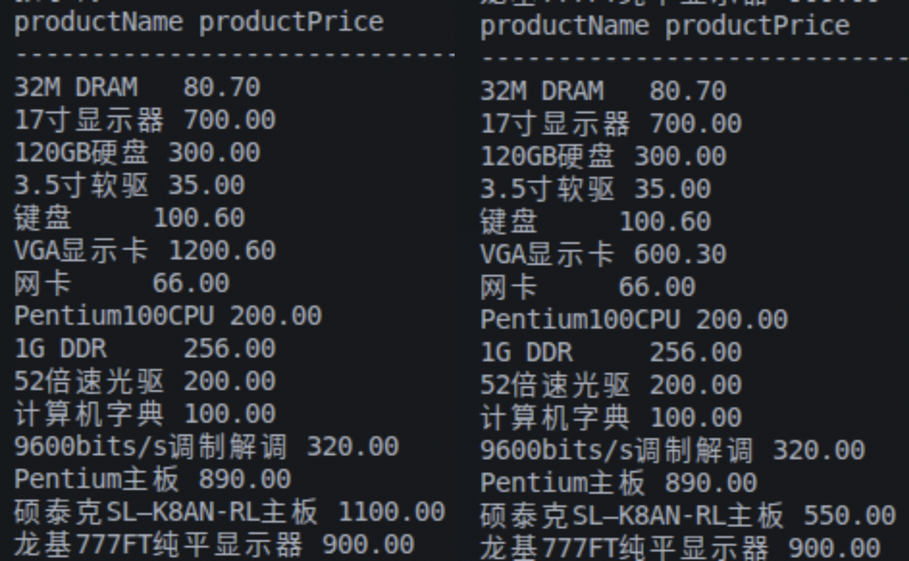

---

### T5

**代码部分：**

```sql
#include <stdio.h>
#include <stdlib.h>
#include <mysql.h>

void print(MYSQL_RES* result){

}

int main(void){
    MYSQL *conn;
    MYSQL_RES *result;
    MYSQL_ROW row;

    // MySQL 连接参数，对应本机上的 OrderDB 数据库。
    const char *host = "127.0.0.1";
    const char *user = "lyh";
    const char *password = "123456";
    const char *database = "OrderDB";
    const unsigned int port = 3306;

    conn = mysql_init(NULL);
    mysql_real_connect(conn, host, user, password, database, port, NULL, 0);

    // 从键盘读入部门名，用它拼接后面的更新和查询语句。
    char str_department[50];
    char sql1[200];
    char sql1_test[200];
    scanf("%49s", str_department);

    // 给指定部门的员工统一加薪 200。
    snprintf(sql1, sizeof(sql1), 
            "UPDATE Employee "
            "SET salary = salary + 200 "
            "WHERE department = '%s'", str_department);

    // 查询该部门员工工资，用于加薪前后对比。
    snprintf(sql1_test, sizeof(sql1_test), 
            "SELECT employeeName, salary "
            "From Employee "
            "WHERE department = '%s'", str_department);

    mysql_query(conn, sql1_test);
    result = mysql_store_result(conn);
    printf("%-10s %-10s\n", "employeeName", "salary");
    printf("--------------------------------------------------------------\n");
    while ((row = mysql_fetch_row(result)) != NULL) {
        printf(
            "%-10s %-10s\n",
            row[0] ? row[0] : "NULL",
            row[1] ? row[1] : "NULL"
        );
    }
    mysql_query(conn, sql1);
    mysql_query(conn, sql1_test);
    result = mysql_store_result(conn);
    printf("%-10s %-10s\n", "employeeName", "salary");
    printf("--------------------------------------------------------------\n");
    while ((row = mysql_fetch_row(result)) != NULL) {
        printf(
            "%-10s %-10s\n",
            row[0] ? row[0] : "NULL",
            row[1] ? row[1] : "NULL"
        );
    }

    // 查询所有客户的名称、地址和电话。
    const char* sql2 = 
            "SELECT customerName, address, telephone "
            "FROM Customer";
    
    mysql_query(conn, sql2);
    result = mysql_store_result(conn);
    printf("%-10s %-10s %-10s\n", "customerName", "address", "telephone");
    printf("--------------------------------------------------------------\n");
    while ((row = mysql_fetch_row(result)) != NULL) {
        printf(
            "%-10s %-10s %-10s\n",
            row[0] ? row[0] : "NULL",
            row[1] ? row[1] : "NULL",
            row[2] ? row[2] : "NULL"
        );
    }
}
```

**实验结果：**

其中部分图像中左侧为操作前，右侧为操作后

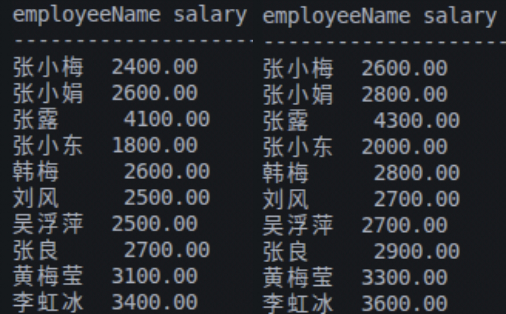

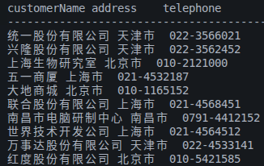

---

## 实验中遇到的困难及解决办法

## 参考文献及致谢

